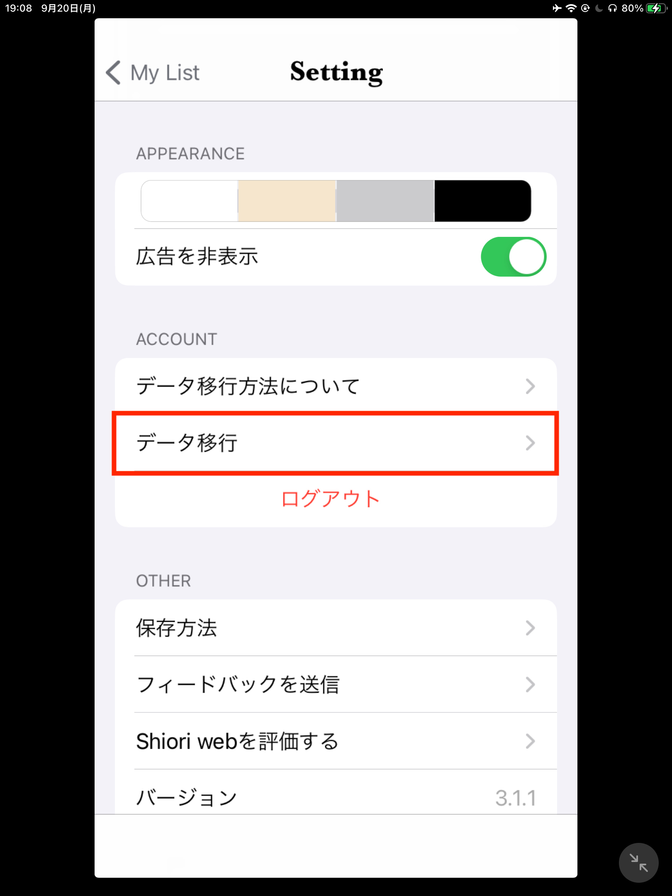

## データ移行方法
Web Shioriをご利用頂き誠にありがとうございます。この記事では、iPhoneに保存されたブックマークをサーバに移行する手順について説明します。

### 対象のユーザー様
Web Shioriをログインせずに使用されていた方

### なぜデータをサーバにアップロードするのか
- Web Shioriはv3以降から、複数デバイス間でブックマークデータを同期できるWebアプリケーションとして生まれ変わります。その機能を実現するため、会員登録後はデータをサーバ上に保存することになります。
- 会員登録せずにご利用頂いた場合、ブックマークデータはお使いのiPhone内に保存されています。データをアップロードして頂ければ、会員登録後もシームレスにご利用頂く事が可能です。
- なお、引き続きログインせずにご利用頂くことも可能です(その場合はデータはアップロードされません)。

### 移行手順
以下のボタンをクリックしてください。

